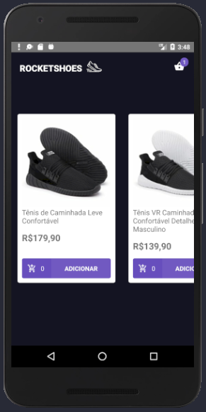

# Rocketseat Bootcamp Challenge - Rocketshoes React Native

Rocketshoes Mobile - Redux, Redux-Saga and React Hooks

## Steps to Setup

1. Install dependencies

```bash
> yarn
```

2. Run api

```bash
> json-server server.json -p 3333
```

3. Run app

```bash
  # android
> react-native run-android

  # ios:
> react-native run-ios
```




